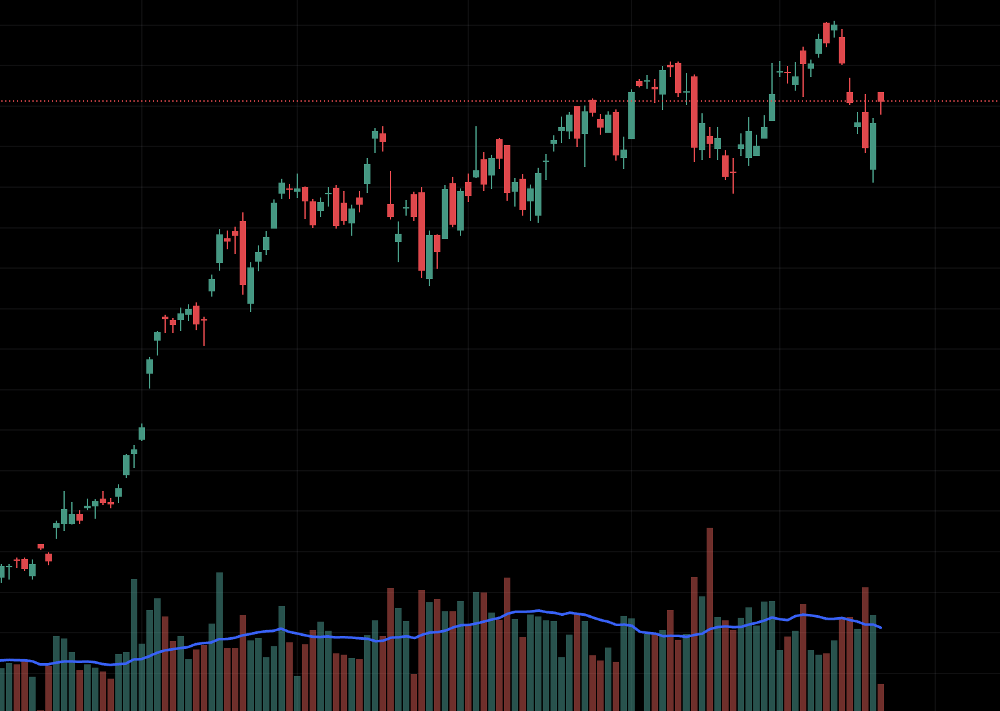

The Indian stock market witnessed a spirited surge on Monday, with the BSE Sensex soaring over 450 points and the Nifty50 breaching the 22,250 mark. By 9:21 AM, the Sensex traded at 73,467, gaining 379 points, while the Nifty50 stood at 22,271, up 124 points.

## Concerns Linger Over Iran-Israel Conflict

This week promises to be eventful for financial markets amid lingering concerns about a potential clash between Iran and Israel. Market analysts caution that if hostilities intensify, it could trigger panic selling and heighten volatility in global stock markets.

## Technical Outlook for Nifty50

> "Nifty has exhibited resilience by holding its 100-DMA and bouncing back from lows of 21,777. While 22,300 poses an immediate hurdle, 22,525 remains the next resistance level. A slip below 22,000 could expose the 100-DMA around 21,700."

*observed Pravesh Gour of Swastika Investmart.*

> "In the absence of strong positive catalysts, volatility is likely to persist. Investors should focus on stock-specific opportunities during this earnings season,"

*commented Siddhartha Khemka of Motilal Oswal.*

> "Technically, Nifty faces resistance at 22,300-350. A decisive break above this zone would signal a resurgence of bullish sentiment," 

*noted Tejas Shah of JM Financial and BlinkX.*

## Global Markets Mixed

The Nasdaq and S&P 500 closed in the red, dragged down by Netflix shares, while American Express boosted the Dow after its earnings report. Subdued market sentiment also stemmed from concerns about the Federal Reserve's reluctance to ease interest rates.

Asian stocks opened higher as investors awaited a flurry of corporate earnings and economic data that could provide clues about central bank policy direction.
Oil prices fell in Asia on Monday as concerns about supply disruptions eased. Israel and Iran downplayed the risks of escalated hostilities, dampening market jitters.

## Currencies Stable

The euro and yen traded sideways in early Asian trading, while the U.S. dollar held near its highs after last week's significant policy and geopolitical developments.

Foreign portfolio investors turned net buyers, investing Rs 129 crore on Friday, while domestic institutional investors sold shares worth Rs 22 crore.

RIL, Hatsun Agro Products, and Tejas Networks, among others, are set to release their fourth-quarter earnings on Monday.

[Image by WangXiNa on Freepik](https://www.freepik.com/free-ai-image/financial-investment-bull-market_65695918.htm#query=stock%20market%20bull&position=2&from_view=keyword&track=ais&uuid=280f104d-85b9-43b5-a899-43339835a1fb)

